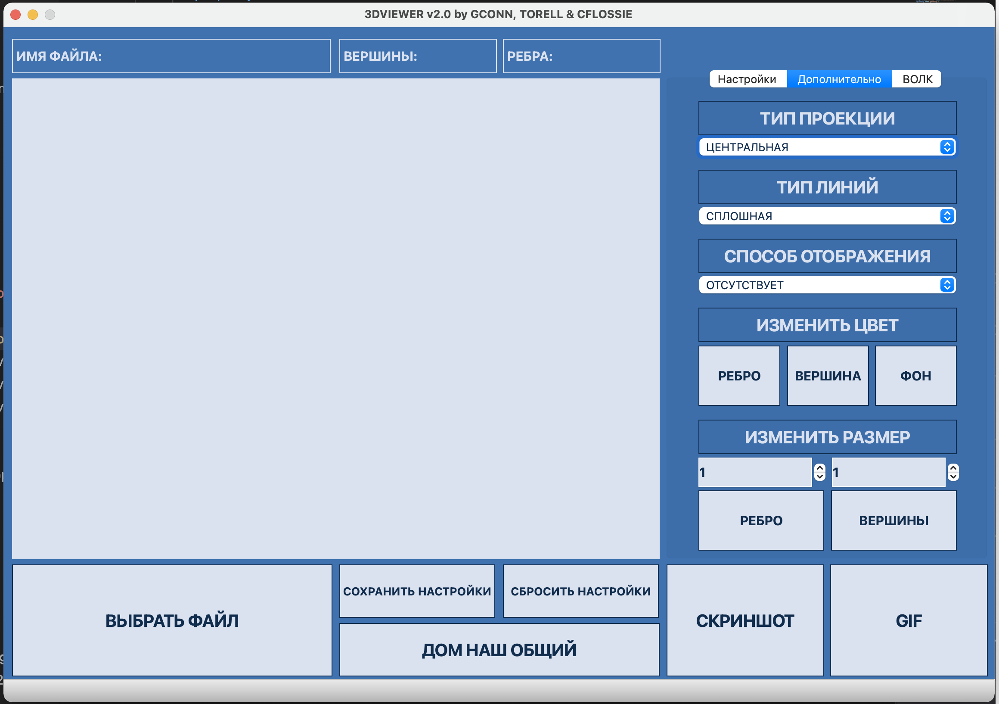
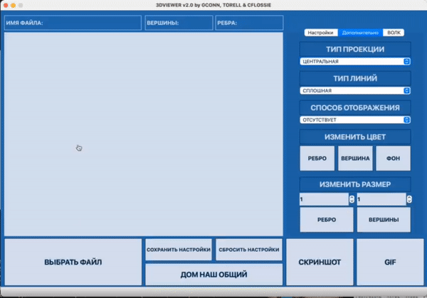
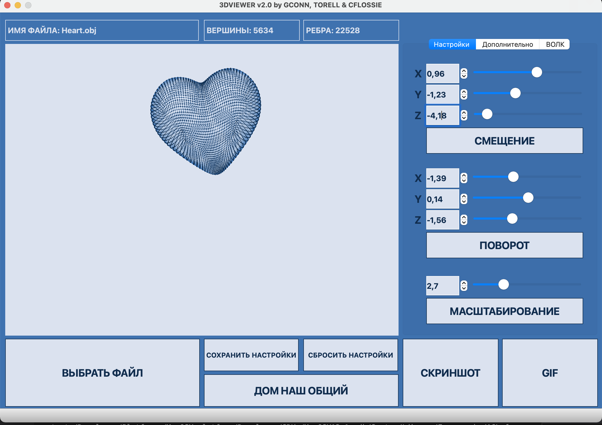
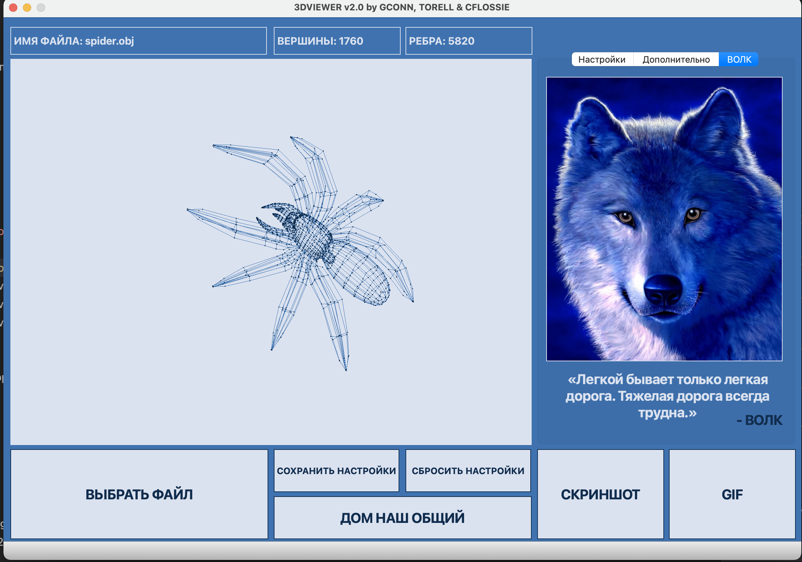

## Руководство 3D-Viewer

---

`В приложении представлен графический интерфейс взаимодействия с 3-D моделями obj файлов:`

### I. ОСНОВНЫЕ ФИЧИ:
- Программа была разработана на языке Си стандарта C11 с использованием компилятора gcc. В версии v2.0 язык разработки изменен на С++ стандарта С++17. Использованы дополнительные библиотек и модули QT
- Сборка программы настроена с помощью Makefile со стандартным набором целей для GNU-программ: all, install, uninstall,clean, dvi, dist, tests, gcov_report.
- Программа разработана в соответствии с принципами принципами объектно-ориентированного программирования
- Обеспечено покрытие unit-тестами модулей, связанных с загрузкой моделей и аффинными преобразованиями
- В один момент времени отрисовывается только одна модель на экране.
- Программа предоставляет возможность:
- Загружать каркасную модель из файла формата obj (поддержка только списка вершин и поверхностей).
- Перемещать модель на заданное расстояние относительно осей X, Y, Z.
- - Поворачивать модель на заданный угол относительно своих осей X, Y, Z
- Масштабировать модель на заданное значение.
- В программе реализован графический пользовательский интерфейс, на базе Qt
- Графический пользовательский интерфейс содержит:
- Кнопку для выбора файла с моделью и поле для вывода его названия.
- Зону визуализации каркасной модели.
- Кнопку и поля ввода для перемещения модели.
- Кнопку и поля ввода для поворота модели.
- Кнопку и поля ввода для масштабирования модели.
- Информацию о загруженной модели - название файла, кол-во вершин и ребер.

### II. ДОПОЛНИТЕЛЬНО. НАСТРОЙКИ
- Программа позволяет настраивать тип проекции (параллельная и центральная)
- Программа позволяет настраивать тип (сплошная, пунктирная), цвет и толщину ребер, способ отображения (отсутствует, круг, квадрат), цвет и размер вершин
- Программа позволяет выбирать цвет фона
- Настройки сохраняются между перезапусками программы

### III. ДОПОЛЬНИТЕЛЬНО. ЗАПИСЬ
- Программа позволяет сохранять полученные ("отрендеренные") изображения в файл в форматах bmp и jpeg
- Программа позволяет по специальной кнопке записывать небольшие "скринкасты" - текущие пользовательские аффинные преобразования загруженного объекта в gif-анимацию (640x480, 10fps, 5s)
### IV. ОСОБЕННОСТИ РЕАЛИЗАЦИИ V2.0
- Программа реализована c использованием паттерна MVC
- Также в программе реализованны следующие три паттеран: "Фасад" (в модели), "Стратегия" (в аффинных преобразованиях), а также "Singleton" (в контроллере).

