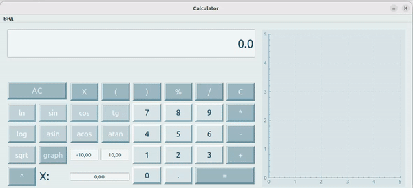

## Руководство Smartcalc_v1.0

---

`В приложении представлен графический калькулятор с поддержкой следующих операции и построением графиков:`
### Поддерживаемые операции::
        Косинус: cos(x)
        Синус: sin(x)
        Тангенс: tan(x)
        Арк косинус: acos(x)
        Арк синус: asin(x)
        Арк тангенс: atan(x)
        Квадратный корень: sqrt(x)
        Натуральный логарифм: ln(x)
        Десятичный логарифм: log(x)

<b>Если функция содержит x, пользователю будет предоставлена возможность подстановки нужного значения
вместо x, также есть возможность отрисовки графика в отдельном окне.</b>

### Кредитный калькулятор

<b>При не правильном вводе приложение сообщает об ошибке.</b>
<b>При количестве символов большем чем 255 сообщает об этом</b>
<b>Кредитный калькулятор помогает расчитывать проценты по кредиту. Пользователь имеет возможность ввести сумму
кредита, количество месяцев, процентную ставку и выбрать тип кредита: аннуитетный или дифференцированный.
Программа высчитывает ежемесячный платеж, процентные выплаты и общую переплату.</b>

Калькулятор был сделан давно-давно давно, когда я еще ничего не делила по папочкам, а сейчас не хочу(

