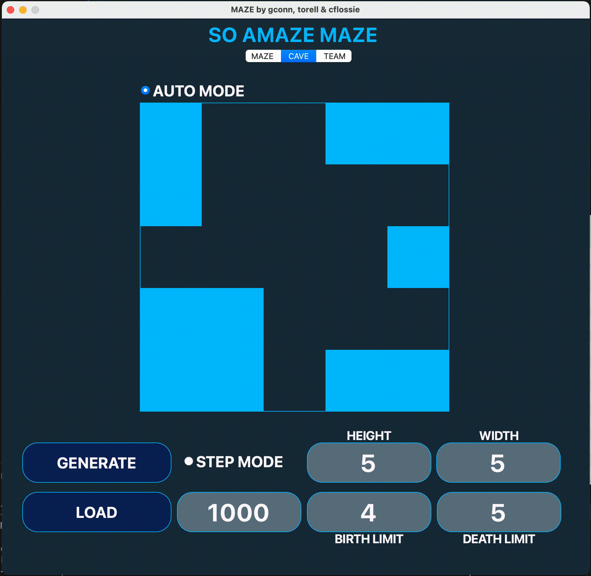
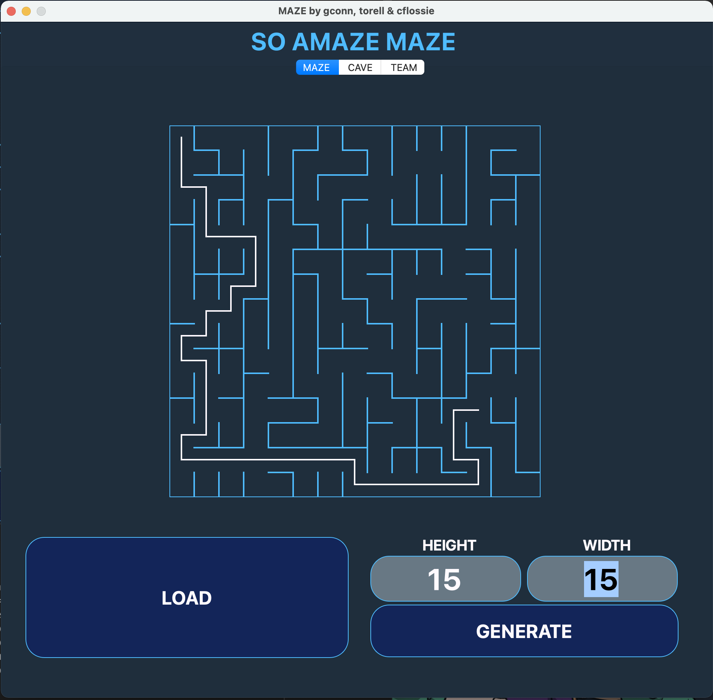
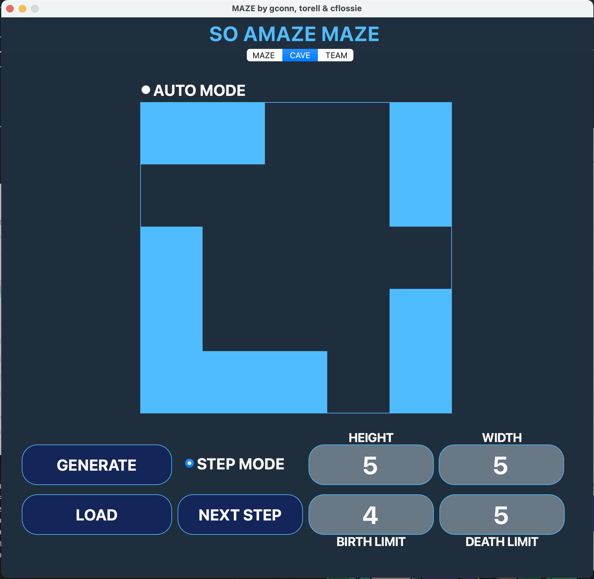

## 3D-Viewer

---

`В приложении представлен графический интерфейс алгоритмов Эллера, генерации пещер, поиска кратчайшего пути между точками и симмуляции жизни клеток пещеры`

 | 

### I. ЛАБИРИННТ

- Программа была разработана на языке С++ стандарта С++17 с использованием компилятора g++. Были использованы дополнительные библиотеки и модули QT
- Сборка программы настроена с помощью Makefile со стандартным набором целей для GNU-программ: all, install, uninstall, clean, dvi, dist, tests. Также есть дополнительные цели (build, gcov_report).
- Программа разработана в соответствии с принципами объектно-ориентированного программирования
- Обеспечено полное покрытие unit-тестами модуля генерации идеального лабиринта.
- В программе предусмотрена кнопка для загрузки лабиринта из файла.
- Максимальный размер лабиринта - 50х50.
- Загруженный лабиринт отрисован на экране в поле размером 500 x 500 пикселей.
- Толщина "стены" - 2 пикселя.
- Размер самих ячеек лабиринта вычисляется таким образом, чтобы лабиринт занимал всё отведенное под него поле.
- Генерирация лабиринта осуществляется согласно алгоритму Эллера.
- Сгенерированный лабиринт не имеет изолированных областей и петель.
- Пользователем вводится только размерность лабиринта: количество строк и столбцов.
- Сгенерированный лабиринт сохраняться в файл.
- Добавлена возможность показать решение любого лабиринта, который сейчас изображен на экране:
- Пользователем задаются начальная и конечная точки.
- Маршрут, являющийся решением, отображен линией толщиной 2 пикселя, проходящей через середины всех ячеек лабиринта, через которые пролегает решение.
- Поворачивать модель на заданный угол относительно своих осей X, Y, Z
- Масштабировать модель на заданное значение.
- Цвет линии решения отличнен от цветов стен и поля
- Обеспечено полное покрытие unit-тестами модуля решения лабиринта

### II. ПЕЩЕРЫ

- Добавлена генерацию пещер с использованием клеточного автомата:
- Пользователем выбирается файл.
- Максимальный размер пещеры - 50 х 50.
- Загруженная пещера отрисована на экране в поле размером 500 x 500 пикселей
- Пользователем задаются пределы "рождения" и "смерти" клетки, а также шанс на начальную инициализацию клетки.
- Пределы "рождения" и "смерти" могут иметь значения от 0 до 7
- Предусмотрен пошаговый режим отрисовки результатов работы алгоритма в двух вариантах:
- По нажатию на кнопку следующего шага отрисовывается очередная итерация работы алгоритма.
- По нажатию на кнопку автоматической работы запускается отрисовка итераций работы алгоритма с частотой 1 шаг в N миллисекунд, где число миллисекунд N задаётся через специальное поле в пользовательском интерфейсе.
- Размер клеток в пикселях вычисляется таким образом, чтобы пещера занимала всё отведенное под него поле
- Обеспечено полное покрытие unit-тестами модуля генерации пещере

